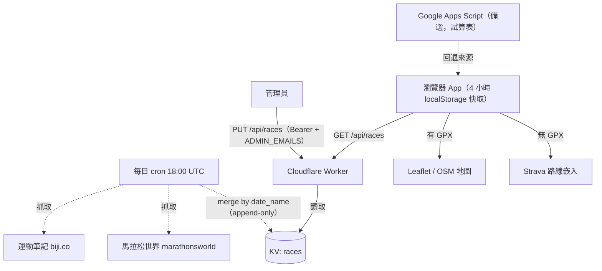

# 配速計算機 (Running Pace Calculator) 🏃‍♂️💨

專為跑者與鐵人打造的**配速換算 × 科學化訓練**離線 PWA：田徑場分段、跑步機換算、完賽預測、VDOT、心率區間、間歇課表、環境配速、補給與恢復、GPX 坡度修正、賽事倒數地圖——全部離線可用、中英雙語、深淺主題。

🌐 **線上使用**：<https://imhahac.github.io/running-pace-calculator/>

> 介面採「任意欄位輸入、即刻換算」；每張工具卡片附**常駐說明與研究引用**。

---

## 功能分頁

頂部分頁（窄螢幕自動換行／可橫向捲動）：

| 分頁 | 內容 |
|------|------|
| 🏃 **配速與分析** | 四種輸入模式（配速 `m:ss`／田徑場道次單圈／跑步機時速／完賽時間反推）即時連動；分段表、E/M/T/I/R 訓練區間、Riegel 完賽預測。km ↔ mile 一鍵切換。 |
| 🏊‍♂️ **鐵人三項** | 選距離（51.5／113／226），輸入總時間反推游／騎／跑分段，或輸入各段配速＋T1/T2 得總時間。 |
| 📅 **課表與賽事** | 賽前**週期化訓練菜單**（分期、里程、每日課表、恢復週、CSV 匯出）、比賽配速規劃（平均／負分段／正分段）、**GPX 路線 GAP 分析**（Minetti 坡度修正）；串接賽事後端後可選賽事、看**倒數**與 Strava／GPX 地圖。 |
| 🧪 **科學評估** | VDOT 訓練配速、心率區間（Tanaka／Gellish／Karvonen ＋ VO₂max）、跑步經濟性＋體組成、科學原則與引用。 |
| 🏗️ **課表設計** | 間歇課表產生器、名師訓練法（Yasso／挪威 4×4／Hansons／雙閾值）、Strides 加速段、步頻分析。 |
| 📈 **監控與適應** | 傷害風險 ACWR、HRV 訓練調整、月經週期調整、海拔訓練規劃。 |
| 🌡️ **環境與補給** | 環境配速調整（露點／WBGT）、卡路里＋補給時間軸、長跑汗率補給、賽前降溫、肝醣超補、Taper 倒數、賽後恢復。 |
| ⚙️ **系統設定** | 語言、單位、分段顯示、預設場地；**賽事後端 URL**；Email 登入雲端同步。 |

### 分享與匯出
- **分享連結**：把目前參數（含各工具輸入）壓成短碼網址，收件者開啟即還原。
- **訓練報表**：「📑 開啟訓練報表」把已產生的週期課表開成可列印／匯出 PDF 的報表頁。
- **匯出 PNG**：一鍵輸出主畫面。

> ⏱️ **時間格式**：`m:ss`（分:秒）或 `h:mm:ss`（時:分:秒）。

---

## 安裝 (PWA)
- **iPhone (iOS)**：Safari 開啟 →「分享」→「加入主畫面」。
- **Android**：Chrome 開啟 → 選單 →「安裝應用程式」。

---

## 賽事資料來源

賽事清單由後端提供；前端的載入、顯示、倒數與地圖都圍繞單一資料來源運作。後端內部機制、cron 爬蟲與**換來源重對接**詳見 [worker/README.md → 賽事爬取與重對接](worker/README.md#賽事爬取與重對接)。

### 資料流



> 若上圖未渲染：瀏覽器 →（4 小時快取）→ `GET /api/races` → Worker → KV `races`；管理員 `PUT` 寫入；cron 每日抓運動筆記＋馬拉松世界並 append-only 合併；前端有 GPX 走 Leaflet/OSM，否則用 Strava 嵌入。

### 兩種後端
- **Cloudflare Worker（推薦）**：穩定、由你掌控，一站包辦賽事 API（`GET /api/races` 由 KV 提供、`PUT /api/races` 由管理員維護）、Email magic-link 登入、跨裝置個人雲端同步。資料存 KV、僅管理員可寫、前端只讀。部署全走 GitHub Actions（金鑰不入 repo，KV namespace 由 CI 自動建立）——**完整設定見 [worker/README.md](worker/README.md)**。
- **Google Apps Script（備選／手動）**：用 Google 試算表當免費資料庫——把 [docs/gas-api-script.js](docs/gas-api-script.js) 部署為 Web App（試算表 `doGet` 直接回傳 JSON），並可選配 [docs/gas-crawler-script.js](docs/gas-crawler-script.js) 自動爬取賽事。試算表第一列欄位：`Date`(YYYY-MM-DD)／`Name`／`Location`／`RegistrationLink`／`StravaFull`／`StravaHalf`，新增列即可維護賽事。**完整設定（兩支腳本的關係、部署、觸發器、疑難排解）見 [docs/GAS_SETUP.md](docs/GAS_SETUP.md)**。

### 前端抓取與顯示
- 從 `${backendUrl}/api/races` 載入（未設則回退 `GAS_API_URL`）；**4 小時 localStorage 快取**、**10 秒逾時**、離線時回退舊快取。
- 選賽事後自動填入「目標日期」並顯示倒數；有 GPX 用 Leaflet（OpenStreetMap 圖磚）畫路線（起點綠／終點紅標記），否則嵌入 Strava 路線。

每筆賽事的 `IRaceEvent` 欄位：

| 欄位 | 用途 |
|---|---|
| `id` | 唯一識別 |
| `date` | `YYYY-MM-DD`；自動填目標日、計算倒數 |
| `name` | 賽事名稱（選單顯示為 `日期 名稱`） |
| `location` | 地點 |
| `registrationLink` | 報名／官網連結 |
| `stravaFull` / `stravaHalf` | 全／半程 Strava 路線 URL（轉 `export_embed` 嵌入） |
| `gpxFull` / `gpxHalf` | 全／半程 GPX URL（**優先於** Strava，前端畫於 Leaflet） |

### 設定後端 URL
- **build 時注入（站台預設）**：GitHub Actions Variable `BACKEND_URL`（仍用舊來源則加 `GAS_API_URL`）會在 build 時烘進 bundle。
- **手填覆寫**：在 **⚙️ 系統設定** 填「後端 URL (Worker)」（非空值一律優先於 build 預設）。設定後即出現賽事選單與 Email 登入框。

### 維護賽事的三種方式
1. **cron 自動爬取（預設）** — 每日 18:00 UTC 自動從**運動筆記**(`?q=competition` HTML)與**馬拉松世界**(`racePage.php` XHR)抓取並 append-only 合併;新賽事自動進清單(Strava／GPX 留空待補)。
2. **管理員 `PUT /api/races`** — 以 JSON 整份覆寫,用於整理清單與補上 Strava／GPX(cron **不會覆寫**手填值);機制與 curl 範例見 [worker/README.md](worker/README.md)。
3. **GAS 試算表（備選）** — 新增列即維護,欄位同 `IRaceEvent`,並可用 [docs/gas-crawler-script.js](docs/gas-crawler-script.js) 自動爬取;設定見 [docs/GAS_SETUP.md](docs/GAS_SETUP.md)。

> ℹ️ 自動爬取的解析依賴來源網站的 HTML 結構;站方若大改版,解析會**乾淨降級**為「不合併」(不報錯)。逐來源抓取/解析細節與**站方改版時的重對接步驟**,詳見 [worker/README.md → 賽事爬取與重對接](worker/README.md#賽事爬取與重對接)。

---

## 開發

### 環境需求
Node.js 24、npm。`npm install`。

### 常用指令
```bash
npm run build         # 型別檢查(tsc --noEmit) → esbuild 打包+壓縮成單一 assets/js/main.js
npm run watch         # tsc 監看模式（開發用）
npm run typecheck     # 僅型別檢查
npm run lint          # ESLint（--max-warnings 0）
npm run lint:fix      # ESLint 自動修正
npm run format        # Prettier 格式化
npm run format:check  # 檢查格式（CI 用）
npm run test          # 單元測試 (node:test + tsx)
npm run test:cov      # 測試 + c8 覆蓋率閘門
```

### 專案結構
```text
.github/workflows/
├── pipeline.yml         # 主站 CI/CD：品質閘門 → 部署 GitHub Pages
└── deploy-worker.yml    # 推送 worker/** 時測試並部署 Cloudflare Worker
scripts/build.mjs        # esbuild 打包（產生 main.js 與 build-info.js 內容雜湊；注入公開 URL）
index.html               # 主頁（8 個功能分頁）
training-report.html     # 可列印訓練報表（自包含，讀 localStorage 的計畫）
diagnostics.html         # 離線/診斷頁
src/
├── main.ts              # 進入點
├── types/index.ts       # 全域型別
├── constants/index.ts   # 常數、雙語翻譯詞條（zh/en key 對齊）、訓練計畫參數
└── modules/
    ├── core/            # 純計算模組：Calculator, VdotCalculator, HeartRateCalculator,
    │                    #   Environmental/Acwr/Cadence/Strides/Fueling/SweatRate/Glycogen/
    │                    #   Cooling/Recovery/Taper/Gap/RunningEconomy/Hrv/Menstrual/Altitude…
    ├── state/           # 狀態/持久化：StateManager, StorageManager, TranslationManager,
    │                    #   ShareManager, ShareExportManager, FormPersistence, BackendClient
    └── ui/              # UIController + 各工具專責 controller、TrainingCycleManager…
tests/                   # 單元測試（node:test）；訓練週期有 golden 位元快照
worker/                  # Cloudflare Worker 後端（KV 賽事 API + magic-link 登入 + 同步）
eslint.config.js / .prettierrc / .c8rc.json   # 品質工具設定
```
> `assets/js/`（編譯產物）與 `coverage/` 為自動產生，已列入 `.gitignore`。

### 技術細節
- **語言/型別**：TypeScript 5（strict），無前端框架（Vanilla），低依賴——核心計算皆為純 TypeScript。
- **打包**：esbuild 將整個 app 打包+壓縮成**單一 ES module**（`assets/js/main.js`）；賽事後端等公開 URL 於 build 時由 GitHub Actions Variables 注入。
- **品質**：ESLint flat config（`no-explicit-any` 為 error、零警告）＋ Prettier；c8 覆蓋率閘門（lines 85／branches 72／functions 60）。每項科學工具皆標註研究引用。
- **PWA／離線**：Service Worker 離線快取＋ localStorage 狀態復原；`CACHE_NAME` 由 build 內容雜湊自動版本化（`assets/js/build-info.js`）。
- **地圖**：Leaflet.js 解析／繪製 GPX/GeoJSON 路線。
- **後端**：Cloudflare Worker（KV、SendGrid magic-link、Bearer session、cron）。
- **CI/CD**：PR/push 跑 typecheck／lint／format／測試+覆蓋率四道閘門，通過後部署 GitHub Pages；Worker 由獨立 workflow 部署。

---

## 後續規劃 (Roadmap)
即時語言重譯體驗優化、Strava 路線/活動整合（需使用者授權）、更多個體化監控整合。

> 賽事爬取現況：運動筆記與馬拉松世界**皆可匿名抓取**,Worker cron 與 GAS 爬蟲([docs/gas-crawler-script.js](docs/gas-crawler-script.js))均已正常運作;站方改版時的重對接步驟見 [worker/README.md → 賽事爬取與重對接](worker/README.md#賽事爬取與重對接)。

---

Created with ❤️ for Runners by [@imhahac](https://github.com/imhahac).
